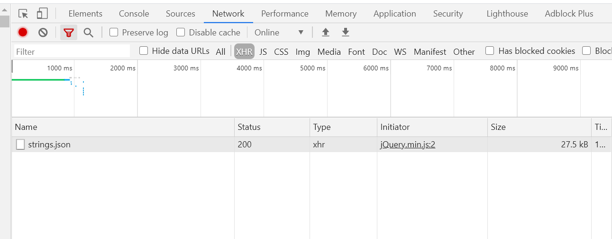
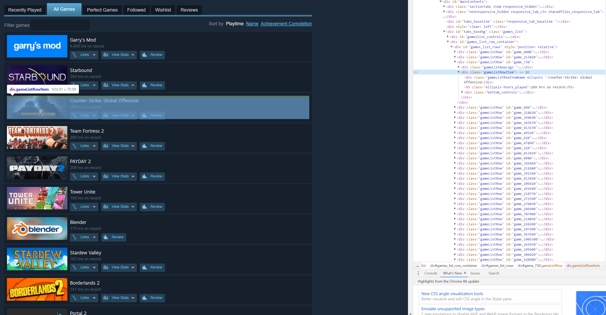
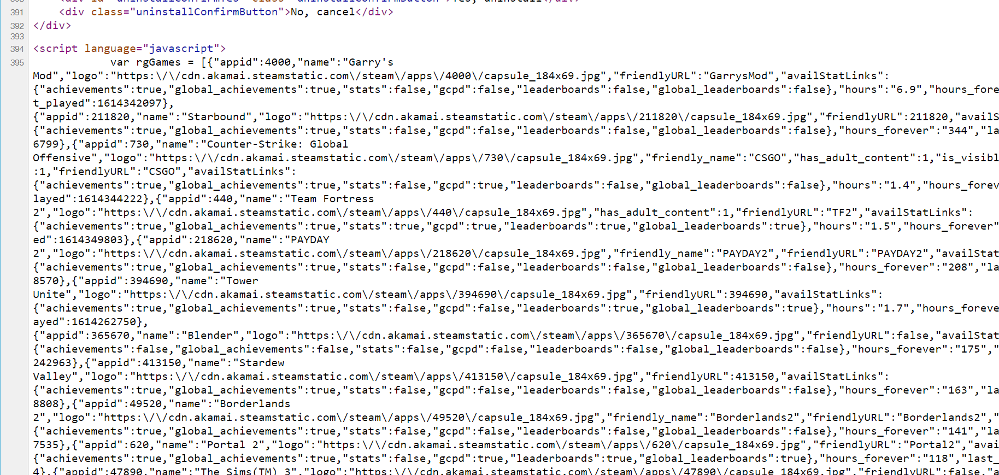

Horizon has a pretty neat feature to help you find what multiplayer games you & your friends have in common.

In order to keep this game data up to date, there's a neat scraper written in Python.
This is a pretty simple scraper in the grand scheme of things - if you're interested in hearing about all my cool scraper experience, let me know!

First step of building a scraper: we should take a deep look at the structure to find any weakpoints. Chrome DevTools is extremely helpful for this!

Most modern websites load the basic "frame" of the page first, then send an XHR request to the server to get the actual data required.
If a site is doing this, it's usually pretty easy to scrape - we can just make that XHR request in our scraper and fetch the data in a nice machine-readable format. In the _Network_ tab of Chrome DevTools, we can find out if these requests are being made.



Unfortunately, the Steam games page isn't doing this. This means that the games list is either rendered server-side, or stored somewhere else. Let's take a look at the page source to see what's happening:



You can see here that each game has a gameListRowItem div - it wouldn't be too difficult to just iterate through these divs and grab the data we need from them. But can we do better? Let's look a little deeper at the source:



Excellent! The full list of games is stored in the Javascript for the page. With a little bit of regex trickery, we can pull this data out of the page and manipulate it however we want.

```python
def get_games_url(steamid: str) -> str:
    return f"https://steamcommunity.com/profiles/{steamid}/games/?tab=all"

url = get_games_url(steamid)
page_content = requests.get(url).text

pattern = re.compile("var rgGames = (\[.*\])")
result = pattern.search(content)
if result:
    json_response = result.group(1)
    games_response = json.loads(json_response)
    return [str(game.get("appid")) for game in games_response]
```

In the real world, please add error handling to your scrapers! There's no guarantee that our requests.get call is going to be successful.

RegEx is pretty scary - but this is a relatively simple case. This pattern pulls out all the data between the []. We can then parse this data as JSON, and presto, we have what we need!
